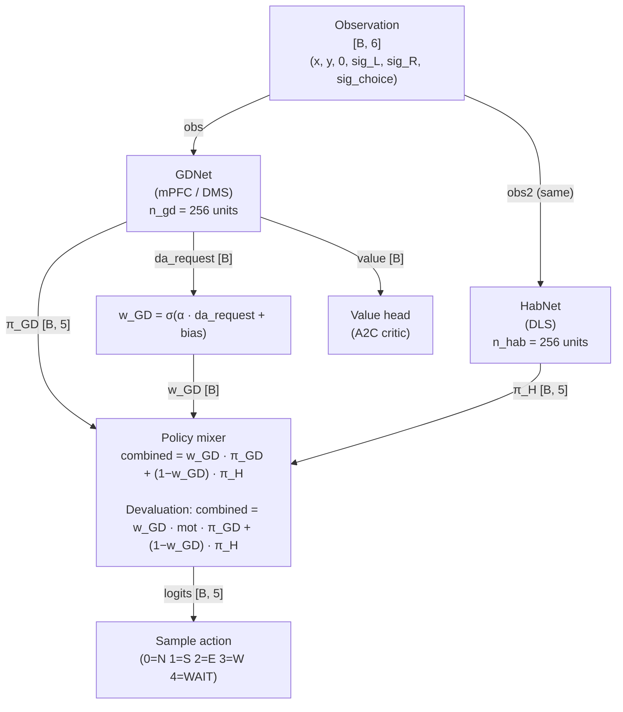
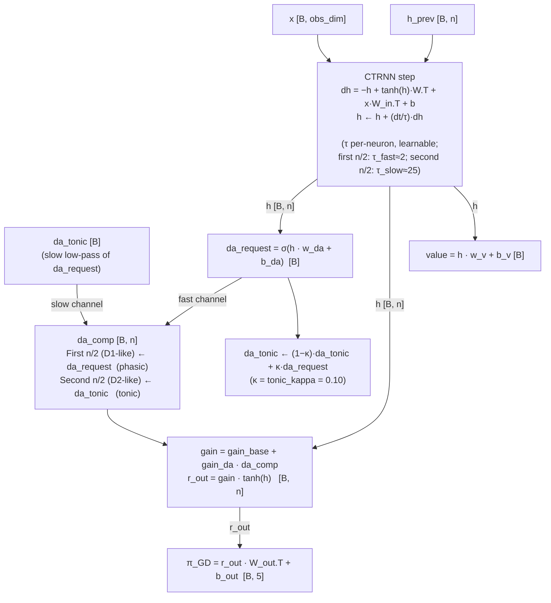
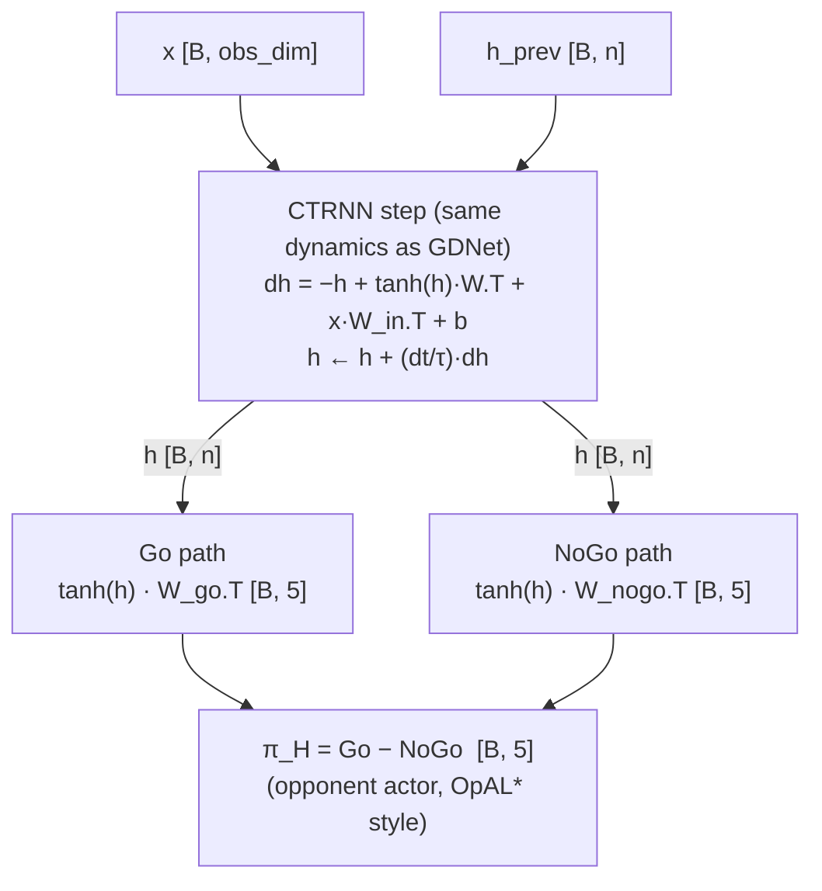
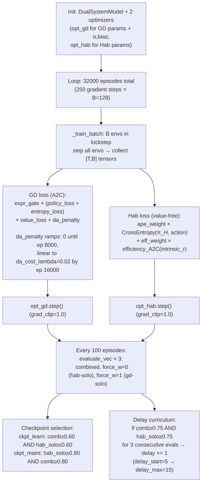
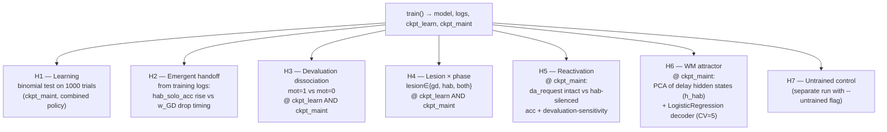

# Architecture & Experiment Graphs

## 1. Neural Network Architecture

### 1.1 Top-level model (DualSystemModel)



### 1.2 GDNet internals



### 1.3 HabNet internals



### 1.4 Key parameters summary

| Component | Parameter | Value |
|-----------|-----------|-------|
| Observation | obs_dim | 6 |
| GDNet | n_gd | 256 |
| HabNet | n_hab | 256 |
| Time constants | τ_fast / τ_slow | 2.0 / 25.0 (first/second half of units) |
| DA gain | gain_base / gain_da | 0.5 / 0.5 |
| DA low-pass | tonic_kappa (κ) | 0.10 |
| Mixing sigmoid | wgd_alpha / wgd_bias | 6.0 / −2.0 (init: w_GD → low) |
| Batch size | B | 128 parallel envs |
| Training episodes | total | 32 000 |

---

## 2. Experiment Design

### 2.1 T-maze task (single trial)

```mermaid
flowchart LR
    START["START (2,2)"]
    STEM["STEM (1,2)"]
    JCT["JUNCTION (0,2)\nphase signal set:\nsig_L or sig_R = 0.25"]
    LEND["L_END (0,0)"]
    REND["R_END (0,4)"]

    START -->|"pre_sample:\nagent walks N×2"| STEM
    STEM -->|"reach junction\n→ phase: sample\n→ task_r += junction_bonus"| JCT

    JCT -->|"open side\n(blocked side impassable)"| LEND
    JCT --> REND

    LEND -->|"reach arm end\n→ phase: delay\n→ task_r += arm_end_bonus"| DELAY["DELAY\nAgent moves freely\nPhase signal decays ×0.1/step\ndelay_idx counts steps\n(delay_start=5 → delay_max=15)"]
    REND -->|"reach arm end\n→ phase: delay"| DELAY

    DELAY -->|"delay_idx ≥ current_delay\n→ phase: choice\nsig_choice = 0.25"| CHOICE["CHOICE\nBoth arms open"]
    CHOICE -->|"non-match arm\n(= blocked arm)"| CORRECT["CORRECT\n+test_reward (1.0)"]
    CHOICE -->|"match arm"| WRONG["WRONG\nno reward"]
```



### 2.2 Training loop



### 2.3 Evaluation pipeline (per seed)



### 2.4 DA dynamics during training (schematic)

```
DA-request
(= w_GD)
   │
   │   ╭──────────────╮
   │   │  GD carries  │
   │   │ the policy;  │    ╭──────────────────
   │   │ DA stays high│   /  Hab competent;
   │   │              │  /   DA penalised;
   │   │              │ /    w_GD drops
   │   ╰──────────────╯/
   │                  /
   │─────────────────/─────────────────────────► episode
   0              ~ep1500                    ~ep2500
                  (hab-solo                  (w_GD drop)
                  crosses 0.8)
```
